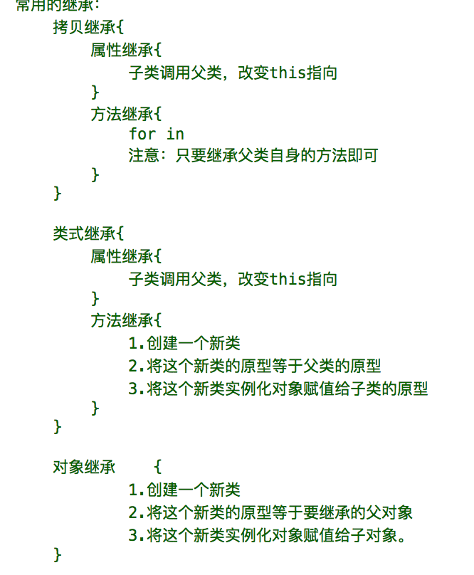

## 面向对象
> - 是一种编程思想,每个角度不一样,理解也不一样(因为每个人的角度不同,看待同一个问题的结果就不同
> - 换了一种(写法)思想去写代码,可以在某个时间点上结果是一样,但是经过多次迭代结果一定不一样,用面向对象的写法会越写越简单,二把具有相同特征的代码抽离出来封装为一类,在这一类上扩充方法或者属性,让这个类(功能)更强大;
### js中的三大特征
>封装,继承,抽象,多态


----------
**属性一定是在某个(非空)对象上的.null(空对象),只有(非空)对象上才能加属性**
**属性或者方法前面都是有主的,都是挂在某个对象上的**
#### 构造函数
> 这个函数专门拿来构造一个对象的
#### 工厂函数
> 有原材料,有加工,有出厂的函数


----------
`new` :运算符---专门运算函数的;
> 用了`new`之后函数可以不用加括号就调用,new运算之后的()主要是为传参用的;
> `new`之后偷偷的在函数内容创建一个空白的对象
> `new`之后函数的默认返回值就为`new`出来的这个对象;
> `return`之后如果后面跟着为对象类型也包括函数,那么返回值就为`return`后面的值,否则就返回`new`出来的对象;

### 原型
>`prototype`:给某个类定义一个class;
>当一个函数被声明的时候,该函数下默认有一个属性:`prototype`;(该属性的值是一个**对象**)当我们去调用一个对象的属性或者方法的时候,如果该对象自身没有该属性或方法,则会调用到该对象的构造函数下的`prototype`下面属性或方法;
>`prototype`是给这个类的实例化对象使用的.(自身用不了)
>`_proto_`:原型链 对象有原型链(对象与构造函数原型的桥梁)
>对象没有原型只有链,函数有原型
>碰到对象找原型链,碰到函数找原型(始终要遵循,原型只给这个类的实例化对象用)
> **如果是对象,那么会先找链->构造函数的原型->构造函数的原型链->对象的原型**
> **如果是找函数:那么会先找链(因为函数的原型是给这个函数的实例化对象使用的)**

### 包装对象
> `str.length`->`new String()`->`length`->2个->`str`
> 当简单类型去查看某个属性或者方法的时候,系统会偷偷滴将这个简单类型转成对象类型的对象,从这个对象去查找要查看的结果,之后这个包装对象自动销毁;这个被销毁的对象为包装对象,整个过程就是简单类型也能查看(调用),某个属性或者方法的原理.
> 简单类型的属性只能读,不能写.`str.length=1`(这样是设置不了的)
> 就算是内置对象,也不能随意去修改属性,只能读;
#### 什么是包装对象
>当使用原始类型的值(`string,number,boolean`),在调用对应属性和方法的时候,内部会自动转成对应的对象.隐式创建的这个对象,就成为包装对象;
>内置的对象:`String,Number,Boolean`;
>包装对象的特点:隐式创建对象后,可以调用对应的属性和方法,使用后,立马销毁,所以不能给原始类型的值添加属性和方法;
>`String`-> 字符串
>`Array`-> 数组
>`Object`-> 对象
>`Number`-> 数字
>


----------


#### `hasOwnProperty`
>查看某个属性是不是这个对象自身的
>注意:**自身,一定是在当前这个对象中(不会沿着原型链查找属性,只查找自身属性)**


----------
#### for in
> -  因为简单类型的赋值就是赋值
> 简单类型的赋值是不会影响另一个数据
> - 而对象类型的复制是赋址
> 对象类型赋值都是引用一个内存地址,所以说,改变arr2,同样会改变arr
> - 解决
> 通过循环,将对象中每个简单类型赋值给另一个对象,就不会出现引用关系;


----------
### `constructor`
>`constructor`会无形被修改,虽然不会改变某个方法的执行结果,但是会影响你的客户维护.
>解决:手动修改`constructor`指向

### `instanceof`
> - 二元运算符:还有`+ - * / | &`
> - 检测某个对象的老爹是不是某个构造函数;
> - 不能检测简单类型;
> - 运算检测一个函数的原型是否在要检测的对象的原型链上; 
> 一元运算符:! new typeof
!


### `call`
> - 方法:
>当某个函数声明的时候系统就默认给这个函数加了一些属性或者方法,其中有一个方法为`call`;
> - 参数:
> 有无数个参数
>  - 第一个参数:
>   改变`this`指向,你写什么`this`就是什么
>   - 第二个参数
> - 函数会被:
> 事件调用,函数名+括号,定时器,匿名函数自执行,`new`,`call`,`apply`
> 


----------
### `apply`
> - 跟`call`的用法是一个德行的,都是改变`this`指向;
> -  跟`call`的区别在参数个数上面,只有两个参数
>  - 第一个参数:改变`this`指向
>  - 第二个参数:是一个数组,是实参的集合,有几个形参,就在数组中写几个对应的实参;
>  


----------
## 继承:
在JavaScript中,继承就是让一个对象拥有另一个对象的方法或者属性;
### 拷贝继承
#### 属性继承
> 调用父类并且将父类的`this`修改成子类,这个时候子类就拥有了父类的属性;
#### 方法继承
> 通过`for in` 遍历父类的原型上的方法,赋值给子类的原型,从而达到方法继承的目的;

#### 类式继承:
> - 属性的继承;
> - 方法的继承;
> #### 属性继承
> 调用父类并且将子类的`this`修改成子类,这个时候子类就拥有了父类的属性;
**类式继承比拷贝继承的性能要高,因为少for in循环**

### 对象继承

 
----------

### `toString`
> 将某种数据类型转成字符串
> 内置对象都有`toString`方法
> `Array`
> `String`
> `Object`
> 只要使用`alert`,那么系统会自动调用该数据类型`toString`
> ```
> var num = 10;
> num.tostring(16)//->a
> ```


----------
## 阶段总结
#### 常用的继承
> - 拷贝继承
> - 类式继承
> - 对象继承



----------
#### 面向过程:关注实现过程和每一步的实现细节
#### 面向对象:关注特性和功能
> 好处:
> 1. 代码的层次结构更清晰
> 2. 更容易服用
> 3. 更容易维护
> 4. 更容易扩展
> 5. more...
>


----------


 ### 关于`this`
 >先分清楚`this`属性的值是什么类型;
 >单纯的函数名+括号,`this`->`window`
 >将一个函数交给事件调用`this`->是触发事件的这个对象
 >定时器中`this`->`window`{只要定时器是直接调用某个函数或者方法,那么`this`就是`window`,否则`this`该是谁就是谁}
 >有主一般情况下,`this`就是主,如果被定时器调用,那么`this`一样是`window`
 >`call`,`apply`写的`this`是谁就是谁
 >`new`->`this`为对象
 >提前存一个`this`,当使用这个`this`的时候,`this`就是存的那个
 >小技巧:匿名函数自执行的时候,前面加`;`目的是为了避免报错;
 >


----------
### 组件
>提供一个完善的功能的方法或数据的封装
>要求:易扩展,易维护;
>


----------
### 自定义事件
>`addEventListener`同一个时间绑定一次或者多次的时候,将同样时间的时间函数,提取出来,当这个事件被触发的时候,依次执行这个事件下的所有事件函数;
>映射:自定义事件
>核心:找到某个事件函数,只要调用一次`addEvent`,就往一个对象的数组中`push`这个函数,当触发某个事件的时候,循环这个数组,依次调用